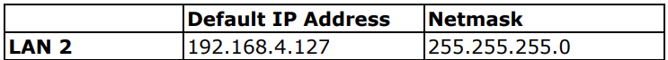

# Getting Started with AWS IoT core Guide for Moxa UC-3400A/UC-4400A series computer

# Document Information
- [Revision History](#revision-history-version-date-description-of-change)
- [Overview](#overview)
- [Hardware Description](#hardware-description)
- [Set up your Hardware Environmen](#set-up-your-hardware-environment)
- [Set up your Development Environment](#set-up-your-development-environment)
- [Troubleshooting](#troubleshooting)

## Revision History (Version, Date, Description of change)

| Version | Date        | Description of change |
| ------- | ----------- | --------------------- |
| 1       | 2025/04/08  | First release         |
| 2       | 2025/04/23  | update typo,          |
|                       | manual's link         |

# Overview

The UC-3400A/UC-4400A computing platform is designed for embedded data-acquisition applications. The computer comes with dual RS-232/422/485 serial ports and dual 10/100/1000 Mbps Ethernet ports, as well as a Mini PCIe socket to support a wireless module. These versatile capabilities let users efficiently adapt the UC-3400A/UC-4400A to a variety of complex communications solutions.

The UC-3400A/UC-4400A is built around a Cortex-A53 processor that has been optimized for use in energy monitoring systems, but is widely applicable to a variety of industrial solutions. With flexible interfacing options, this tiny embedded computer is a reliable and secure gateway for data acquisition and processing at field sites as well as a useful communications platform for many other large-scale deployments.

Additionally, UC-3400A/UC-4400A series support Wide-temperature and LTE. All units of UC-3400A/UC-4400A series are thoroughly tested in a testing chamber, guaranteeing that the LTE-enabled computing platforms are suitable for wide-temperature applications.
# Hardware Description

## DataSheet

[UC-3400A series](https://cdn-cms-frontdoor-dfc8ebanh6bkb3hs.a02.azurefd.net/getmedia/67e7ba24-84eb-465b-9922-87739a8b17e1/moxa-uc-3400a-series-datasheet-v1.0.pdf)

[UC-4400A series](https://cdn-cms-frontdoor-dfc8ebanh6bkb3hs.a02.azurefd.net/getmedia/2d63a2b2-e2bf-405c-b712-d4e92007114e/moxa-uc-4400a-series-datasheet-v1.1.pdf)

## Standard Kit Contents

The standard shipping Moxa UC-3400A/UC-4400A series computer package contains the following items:

- 1 x UC-3400A/UC-4400A embedded computer
- 3 x round stickers to prevent tampering of screws
- 1 x Quick installation guide (printed)
- 1 x Warranty card

## User Provided items

To setup and operate Moxa UC-3400A/UC-4400A series computer, users have to prepare the following items by themselves.

- 10/100/1000M Ethernet cables
- Power adapter: input voltage 90 to 264 VAC, output voltage 24 V with 2.5 A DC load (can be purchased separately from Moxa)
- Power Cord: Power cord with AU/CN/EU/UK/US plug, 2.5A/250V, 1.83 m (can be purchased separately from Moxa)


Based on user’s application requirement, the following items are optional

- WiFi or Cellular module (can be purchased separately from Moxa)
- Antennas (can be purchased separately from Moxa)

## 3rd Party purchasable items
N/A

# Set up your Hardware Environment

- **Powering on Moxa UC-3400A/UC-4400A series computer :**

	To power on the UC-3400A/UC-4400A, connect the "terminal block to power jack converter" to the UC-3400A/UC-4400A's DC terminal block (located on the side panel),and then connect the 12 to 24 VDC power adapter. If the power is supplied properly, the Ready LED will glow a solid green after a 25 to 30 second delay. For surge protection, connect the grounding connector located below the power connector with the earth (ground) or a metal surface. 

- **Accessing Moxa UC-3400A/UC-4400A series computer Using a Linux/Windows PC or Mac**

    You can use a PC to access Moxa UC-3400A/UC-4400A series computer by using SSH over the network. Refer to the following IP addresses and login information:

    

    Login: moxa

    Password: moxa

    Root account login is disabled until you manually create a password for the account. The user moxa is in the sudo group so you can operate system level commands with this    user using the sudo command.

    **ATTENTION: For security reasons, we recommend that you disable the default user account and create your own user accounts or** 

    **Refer to Account Management of [Moxa UC-3400A/UC-4400A series computer-linux-user-manual](https://cdn-cms-frontdoor-dfc8ebanh6bkb3hs.a02.azurefd.net/getmedia/2a7876ef-64ed-43b6-af1c-63544980b003/moxa-arm-comp-mil-3.x-debian-11-security-hardening-guide-manual-v2.1.pdf) for the detail steps.**

- **Change the network settings of Moxa UC-3400A/UC-4400AA series computer based on your network environment**

    Refer to the Changing the interfaces Configuration File of [Moxa UC-3400A/UC-4400A series computer-linux-user-manual](https://cdn-cms-frontdoor-dfc8ebanh6bkb3hs.a02.azurefd.net/getmedia/2a7876ef-64ed-43b6-af1c-63544980b003/moxa-arm-comp-mil-3.x-debian-11-security-hardening-guide-manual-v2.1.pdf) for the detail steps.

# Set up your Development Environment

## Tools Installation (IDEs, Toolchains, SDKs)

The operation system of Moxa UC-3400A/UC-4400A series is a native 64-bits ARM64 Linux operating system. There is no need to install toolchains. You can install development tools in Moxa UC-3400A/UC-4400A series computer directly.

Follow these steps to update the package menu:

1. Make sure a network connection is available.

2. Use apt-get update to update the Debian package list.

```bash
moxa@Moxa:~$ sudo apt-get update
```

3. Install the native compiler and necessary packages.

```bash
moxa@Moxa:~$ sudo apt-get install gcc build-essential flex bison automake
```

## Setup your AWS account and Permissions

Refer to the instructions at [Set up your AWS Account](https://docs.aws.amazon.com/iot/latest/developerguide/setting-up.html). Follow the steps outlined in these sections to create your account and a user and get started:

- [Sign up for an AWS account](https://docs.aws.amazon.com/iot/latest/developerguide/setting-up.html#aws-registration)
- [Create an administrative user](https://docs.aws.amazon.com/iot/latest/developerguide/setting-up.html#create-an-admin)
- [Open the AWS IoT console](https://docs.aws.amazon.com/iot/latest/developerguide/setting-up.html#iot-console-signin)


## Create Resources in AWS IoT

Refer to the instructions at [Create AWS IoT Resources](https://docs.aws.amazon.com/iot/latest/developerguide/create-iot-resources.html). Follow the steps outlined in these sections to provision resources for your Moxa UC-3400A/UC-4400A series computer:

- [Create an AWS IoT Policy](https://docs.aws.amazon.com/iot/latest/developerguide/create-iot-resources.html#create-iot-policy)
- [Create a thing object](https://docs.aws.amazon.com/iot/latest/developerguide/create-iot-resources.html#create-aws-thing)

Pay special attention to the Notes.

> **Important**
Before you continue to the next step, your Moxa computer must be configured, and running. The Moxa computer must be connected to the Internet and you will need to be able to access the computer by using its command line interface. Command line access can be through SSH terminal remote interface.

## Build the demo

Follow above section, **Accessing Moxa UC-3400A/UC-4400A series** **computer Using a Linux/Windows PC or Mac,** using PuTTY to open a remote terminal to Moxa computer on **Linux/Windows PC or Mac** and perform the following instructions in that window. 

Refer to the instruction at [Install the required tools and libraries for the AWS IoT Device SDK](https://docs.aws.amazon.com/iot/latest/developerguide/connecting-to-existing-device.html#gs-device-sdk-tools) and [Install AWS IoT Device SDK](https://docs.aws.amazon.com/iot/latest/developerguide/connecting-to-existing-device.html#gs-device-install-sdk) for Python on Moxa UC-3400A/UC-4400A series computer directly. Follow the steps outlined in these sections to install AWS IoT Device SDK for your Moxa computer:

- Update the operating system and install required libraries
- Install git
- Install the AWS IoT Device SDK for Python.

Note: Due to using Python, there is no need to compile/build any programs. And we perform all steps in Moxa computer, there is no need to load/upload any programs to it.

## Run the demo

Continue previous section, perform the instructions, [Install and run the sample app](https://docs.aws.amazon.com/iot/latest/developerguide/connecting-to-existing-device.html#gs-device-node-app-run), in that terminal window. 

To view the MQTT messages published by the sample app in the AWS IoT console, perform the instructions,[View messages from the sample app in the AWS IoT console](https://docs.aws.amazon.com/iot/latest/developerguide/connecting-to-existing-device.html#gs-device-view-msg).

## Debugging

1. Not able to login Moxa UC-3400A/UC-4400A series computer's through SSH terminal.

    Connect console port of Moxa UC-3400A/UC-4400A series computer, and then power it up. Once the system is ready, a login prompt will appear on your monitor. Refer to Connecting through the Serial Console of [**Moxa UC-3400A/UC-4400A series computer-linux-user-manual](https://cdn-cms-frontdoor-dfc8ebanh6bkb3hs.a02.azurefd.net/getmedia/2a7876ef-64ed-43b6-af1c-63544980b003/moxa-arm-comp-mil-3.x-debian-11-security-hardening-guide-manual-v2.1.pdf)** for the detail steps. After login Moxa computer check following items:

    a. Check if IP address of LAN1/LAN2 is in the same subnet of your PC.

    b. Check if you are able to operate OS normally. If not, gather all error message when you operate OS and then [CONTACT US](https://www.moxa.com/en/support/technical-support)

2. Moxa computer is not able to access internet.

    a. Check if IP address, mask and gateway of LAN1/LAN2 are configured in /etc/network/interfaces properly.

    b. Check if routing is correct.

    c. Check if nameserver is configured in /etc/resolv.conf

# Troubleshooting

Still need assistance with your Moxa product? [CONTACT US](https://www.moxa.com/en/support/technical-support)
